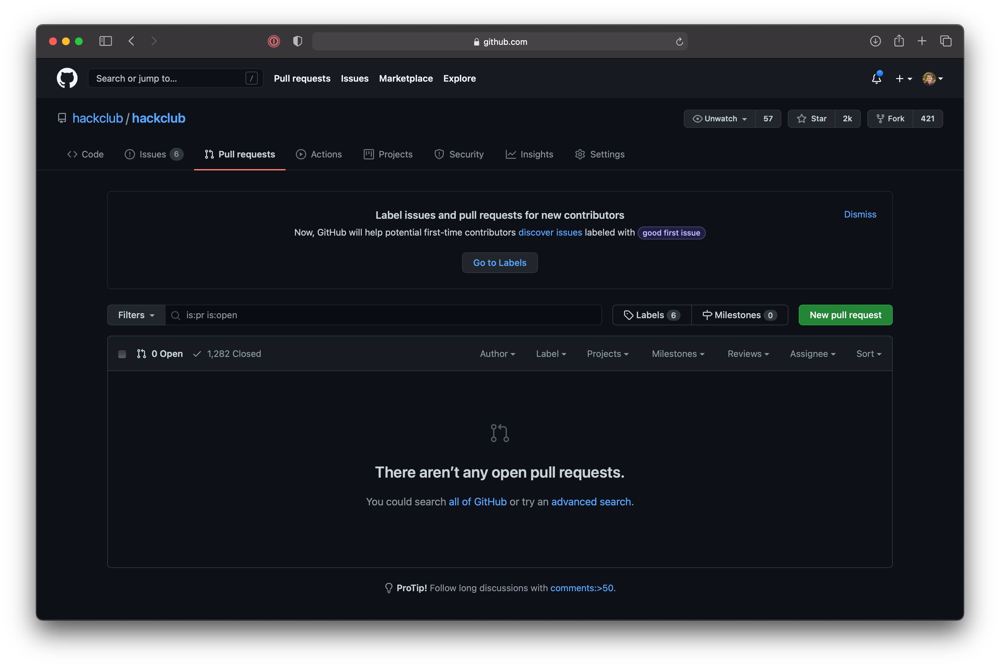
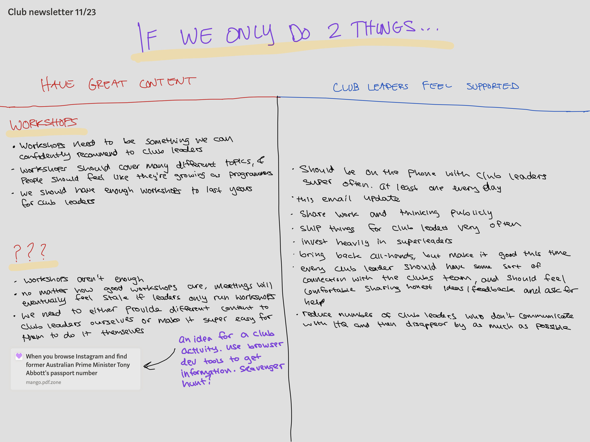
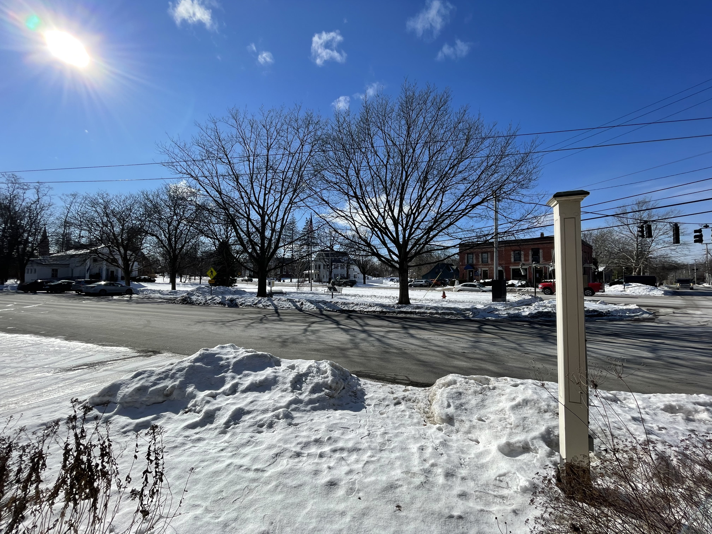

# Club Leader Update 3 (2/08/2021)

Hey friends 🦕

Matthew from Hack Club here. In November, I started a new experiment: [a semi-regular update](https://github.com/hackclub/club-leader-updates/tree/main/updates) from HQ for every club leader that I've onboarded or otherwise been in contact this year. Since [the previous one](https://github.com/hackclub/club-leader-updates/blob/main/updates/11-23-2020.md), many club leaders have told me that they would love to see more. So, hello again! And if you're receiving this email for the first time, welcome to the club 👁

The [workshop bounty program](https://hackclub.com/workshop-bounty/) ended at the end of 2020, so I thought I would be continuing these emails in January, but instead I spent all of January (and a few days into February) plowing through the backlog of remaining workshops. Finally, last Wednesday, hackclub/hackclub reached 0 open pull requests 💪

This was a ridiculously heavy lift—it took all my time for the last few months, and countless hours of focused work—but it resulted in 84 new fantastic workshops for club leaders. If you haven't seen them, [check them out!](https://workshops.hackclub.com)

My personal favorites (in no particular order): [Hacking Kahoot](https://workshops.hackclub.com/kahoot/), [Tunes on JS](https://workshops.hackclub.com/tunes/), [Animated 3D Models](https://workshops.hackclub.com/3d_models_with_zdog/), [Konami Code](https://workshops.hackclub.com/konami_code/), [Meme Songs with Arduino](https://workshops.hackclub.com/coffin_dance_arduino/), [Spin the Wheel](https://workshops.hackclub.com/spinning_wheel/), [Orpheus Run](https://workshops.hackclub.com/orpheus_run/), [Atari Breakout](https://workshops.hackclub.com/atari_breakout/), [Pixel Art Pad](https://workshops.hackclub.com/pixel_art_pad/), [Particle Physics](https://workshops.hackclub.com/particle_physics/), [Text Adventure Game in Rust](https://workshops.hackclub.com/rust_text_game/), [VR World](https://workshops.hackclub.com/vr_worlds/). Try them out in your club and let me know what you think!

Now that the workshop bounty program is behind me, I've had some time to do some deep thinking about the clubs at the end of last week and over the weekend. I'm thinking about this "whiteboarding" session that I shared last time:

From talking with club leaders, and from my own experience leading a Hack Club, I've found that if you don't "switch up" your club meetings, your club is likely to become stale, and people are likely to leave. In October, the problem with the workshops was that we literally didn't have enough workshops to last most club leaders a semester. Now, we have enough workshops to last most club leaders multiple years, but club leaders will still need to find a way to "switch up" their club meetings every once in a while to prevent their meetings from becoming stale. Many club leaders struggle to do this when they get started. So how can HQ make club leaders' lives easier? Broadly, I see 2 paths:

1. Form deep relationships with every one of you. Spend lots of time talking to all club leaders, talking through issues and brainstorming meetings. Establish the norm that regular phone calls between you and HQ are part of being a Hack Club leader.
2. Introduce lots of workshops that feel different and unique, so that even if all you do as a club leader is read through a workshop every week, you'll still be able to run a decent club.

Number 1 is the tried and true method. It's what Zach (the founder of Hack Club) did back in the very early days of Hack Club, when we were called hackEDU and had 10 total active clubs. I do want to do some of that this month. But "talking to club leaders" is not a real clubs _program_, and more importantly, it's not scalable.

My eyes are mostly focused on number 2 right now. What if there were a way to introduce dozens of workshops that were all a lot different than most of the current workshops? What if every workshop were [Hacking Kahoot](https://workshops.hackclub.com/kahoot/), [The Adventures of Hack Island](https://workshops.hackclub.com/save_hack_club_bank/), or [Pixel Art Pad](https://workshops.hackclub.com/pixel_art_pad/)? What does that look like? Maybe a workshop team? Or maybe...rebooting the workshop bounty program?

If we do reboot the workshop bounty program, it won't be for a while, because sweaty..,,, i am **HELLA** burnt out on reviewing workshops and I am definitely not ready to jump back in for at least another few weeks. But it is something I'm strongly considering.

I would love to hear what you think. How have you felt the workshops have served you as a club leader? Where can I be most helpful right now? Reply to this email and let me know. Or, if you're up for it, DM me on Slack (@matthew) and I would love to chat about it over the phone!

Those are all of my thoughts for now. Let me know what you think. See you soon 💫

✨🚀👁 Matthew

BONUS CONTENT:

* ❄️ Here's the view from the office in Shelburne, VT today

* 🎧 I've been loving [Superorganism's debut album](https://album.link/us/i/1316670136) today. It's a short collection of super catchy, kinda weird dreampop/psychedelic pop songs.
* ❓ 1644 E Evans Ave, Denver, CO 80210

(P.S. I'm not using any mail software to send this—I literally just BCCed as many active club leaders as I could find into Gmail. If you don't want to receive emails from me, or you're not running a club anymore, just reply and let me know.)
