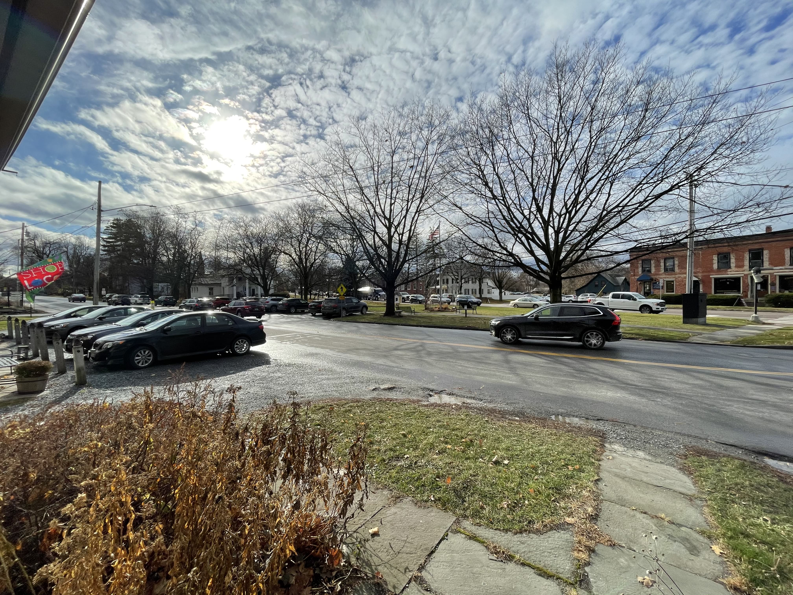

# Club Leader Update 2 (11/23/2020)

Hey friends 🦕

Matthew from Hack Club here. Two weeks ago, I sent you [the first edition](https://github.com/hackclub/club-leader-updates/blob/main/updates/11-10-2020.md) of a new experiment I'm trying: a weekly-ish update for every club leader who I've onboarded or otherwise been in contact with this year. This is the second edition.

Last week, I stumbled across [this blog post](https://mango.pdf.zone/finding-former-australian-prime-minister-tony-abbotts-passport-number-on-instagram) written by a programmer who accidentally found the former Australian Prime Minister's passport number using the "Network" tab of the dev tools in their browser (what you see when you "inspect element") on Qantas's website. This sounds crazy, complicated, and illegal, but we actually use that same trick to access undocumented Slack API methods to write cool apps for our community that we wouldn't otherwise be able to write. This got me thinking: what if we introduced a new type of content for clubs—not workshops, but guided journeys that end in a competition or prize? This can be anything from a scavenger hunt using dev tools, to a weird website building competition, to [Code in the Dark](https://github.com/codeinthedark/codeinthedark.github.io).

After reading that blog post, I started doing some high-level thinking around the clubs program. Here's where I ended up:

([view a larger version](https://cloud-6uettjc1g.vercel.app/0club_newsletter_1123.pdf))

If we only do two things—provide great content for clubs and make sure club leaders feel supported by HQ—we'll have a great clubs program. There's work to be done across the board, but right now I really want to focus on that "???" section. We present the workshops as the "official Hack Club curriculum", as if running only workshops will create successful clubs—but in reality, every club I'm aware of that only ran workshops and nothing else became stale and their club members began to leave (including my own club!). Getting out of this hole is difficult and stressful, and I believe it's the cause of death for most clubs. I think the idea I had—providing guided journeys and fun events in addition to workshops—could be the missing piece that keeps clubs running.

I'm going to spend this week exploring this idea—and hopefully, by next week, I'll have a demo to share. In the meantime, here's my ask to you: **let me know what you think!** I would love to get on the phone with you and get a feel for whether or not my plans will help you as a club leader. If you've got 20 minutes to spare, let me know by replying to this email or DMing me on Slack.

Also: a huge thank you to Hugo, Lorenzo, and Arianna, for getting on the phone with me. I had an amazing conversation with each of you, and you all helped shape my thinking last week.

See you next week,
✨🚀👁 Matthew

BONUS CONTENT:

- 🌳 Here's the view from the office in Shelburne, VT today

- 🎧 I've been loving [Melody's Echo Chamber's self-titled album](https://album.link/i/1194793478). It's a collection of blissful, Tame Impala-style psychedelic rock. I started listening to it in early 2019 and haven't stopped since.
- 🔥 [Here's a picture of David Lynch holding a Minecraft torch](https://cloud-nmgo71u5t.vercel.app/0img_0411.jpg)

*(I'm not using any fancy software to send this email—I'm literally just pasting all of your emails into the Gmail BCC field. If you don't want to receive these emails, no worries! Just reply and let me know and I won't include you in the next one.)*
